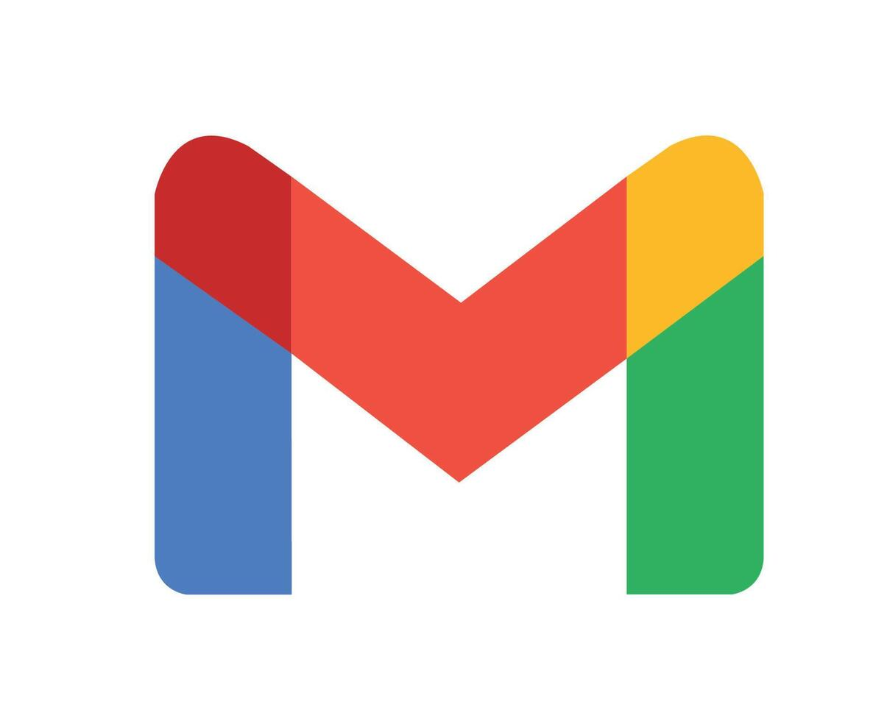
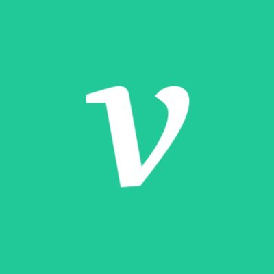

  

<!-------------- 컨택트 영역 시작 -------------->

  <h3 style="color: rgba(33, 85, 255, 0.87);">🏖️ Contact</h3>
  <h4>이혜원 (Hyewon Lee, 李蕙園)</h4>
  <h5>Software Engineer, Backend & Robotics</h5>

  <blockquote>
    <strong>변화에 유연한 구조를 고민하는 개발자 🦎</strong>
  </blockquote>

  <ul>
    <li>
      
        
        <strong>Email</strong> |
        <a href="mailto:0w0n2x@gmail.com">0w0n2x@gmail.com</a>
      
    </li>
    <li>
      <a href="https://www.linkedin.com/in/%ED%98%9C%EC%9B%90-%EC%9D%B4-a72783386/">
        
        <strong>Linked In</strong>
      </a>
    </li>
    <li>
      <a href="https://velog.io/@0w0n/posts">
        
        <strong>Blog</strong>
      </a>
    </li>
  </ul>
  <!-- <li><a href="https://recondite-crystal-dac.notion.site/Portfolio-0w0n2-2b686992872680beb6d9e925c9525186?source=copy_link"><strong>Portfolio 🔗</strong></a></li> -->

<!-------------- 프로젝트 영역 시작 -------------->
<!-- 

  <h3 style="color: rgba(33, 85, 255, 0.87);">🌀 Projects</h3>
  <ul>
    <li>
      <strong>🔊 Voida</strong>
       
      립리딩 모델과 WebRTC 기술을 활용한 청각장애인 구화 인식 기반 화상 통화 프로젝트
       
      <a href="https://github.com/gyudol/voida">Github</a>
      |
      <a href="https://recondite-crystal-dac.notion.site/VOIDA-2b68699287268024bd5fd5370666dddb?source=copy_link">회고</a>
    </li>
    <li>
      <strong>🐙 TAKO</strong>
       
      하자 검증 비전 모델과 블록체인 컨트랙트 기술이 적용된 TCG 카드 경매 서비스
       
      <a href="https://github.com/0w0n2/tako">Github</a>
      |
      <a href="https://recondite-crystal-dac.notion.site/TAKO-2b686992872680bea5f9fc22a47872b6?source=copy_link">회고</a>
    </li>
    <li>
      <strong>🌲 NAMUH</strong>
       
      소아암 환아를 위한 휴머노이드 친구 프로젝트
       
      <a href="https://github.com/0w0n2/namuh">Github</a>
      |
      <a href="https://recondite-crystal-dac.notion.site/NAMUH-2b686992872680d280e5d3f1bcdb9f93?source=copy_link">회고</a>
    </li>
  </ul>

 -->
<!-------------- 프로젝트 영역 끝 -------------->
<!-- 

  
  
  

 

  

 -->